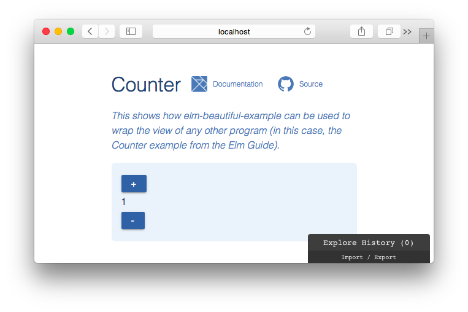

# elm-beautiful-example

This package makes it easy to create beautiful examples for your Elm projects
and packages.

## Example



The screenshot above shows what is produced when wrapping the Counter example
from the Elm Guide with elm-beautiful-example
([see full code](examples/Counter.elm)):

```elm
beautifulView : Model -> Html Msg
beautifulView model =
    view model
        |> BeautifulExample.view
            { title = "Counter"
            , details =
                Just """This shows how elm-beautiful-example can be used to
                  wrap the view of any other program (in this case, the Counter example
                  from the Elm Guide)."""
            , color = Just Color.blue
            , maxWidth = 400
            , githubUrl = Just "https://github.com/avh4/elm-beautiful-example"
            , documentationUrl = Just "http://package.elm-lang.org/avh4/elm-beautiful-example/latest"
            }
```
